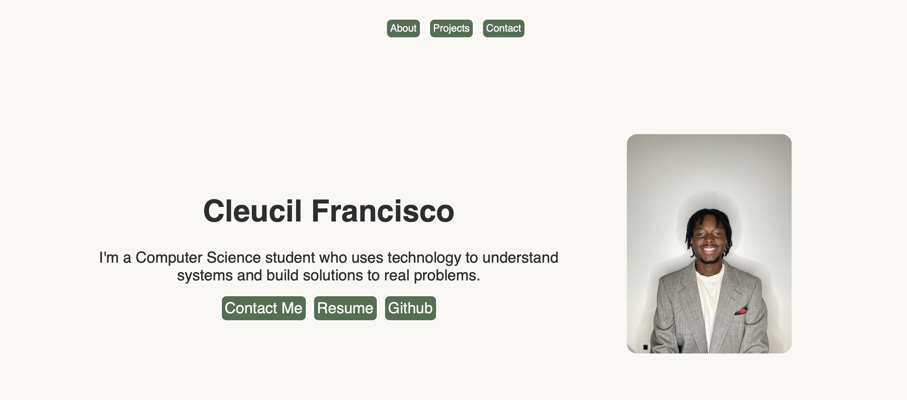

# Portfolio

A personal portfolio website showcasing my projects, technical skills, and approach to problem solving. The website was built from scratch using HTML and CSS as a way to learn front-end web development while creating a professional portfolio.

## Live Demo

🌐 https://cleucilf.github.io/portfolio/

## Features

- Responsive two-column hero section
- About section introducing my background and interests
- Project showcase with detailed descriptions
- Contact section with GitHub, LinkedIn, and email
- Internal page navigation
- Clean, minimal design

## Technologies

- HTML5
- CSS3
- Flexbox
- Git
- GitHub Pages

## What I Learned

This project helped me develop a stronger understanding of semantic HTML, CSS layout with Flexbox, responsive design principles, and organizing a front-end project from planning to deployment. It also gave me experience deploying a static website with GitHub Pages and designing a user experience instead of simply writing code.

## Future Improvements

- Improve mobile responsiveness
- Add JavaScript interactions
- Enhance accessibility (WCAG)
- Add animations and transitions
- Expand project case studies

## Author

**Cleucil Francisco**

- GitHub: https://github.com/cleucilf
- LinkedIn: https://linkedin.com/in/cleucil
